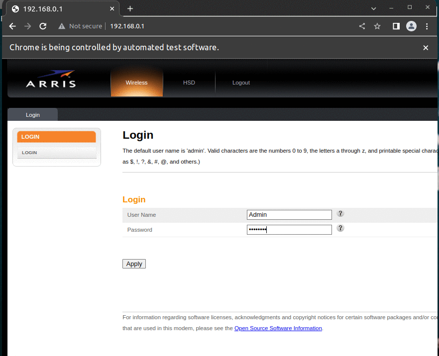

## Simulate actions with Selenium

In the Router arris TG2482, to block some mac addresses from having access to internet connection, you have to do several manual steps.

_1 Login to the router_   
_2 Go to 2.4 GHZ section_   
_3 Go to Mac Address Control Section_
_4 Add the Mac Address to one list_
_5 Apply the Block option_

The script automates those steps except step 4, and it uses Selenium to do so. 
For example, if you want to block a specific mac address at a specific time, all you have to do is to have the list of mac addresses and schedule the execution of the script with cron.

